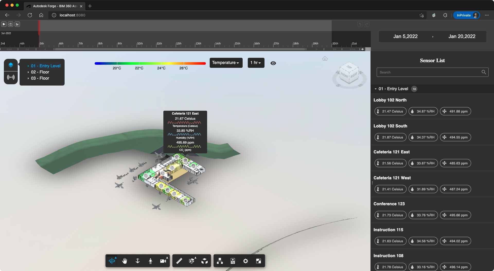

# forge-dataviz-iot-react-components-es5

[](https://badge.fury.io/js/forge-dataviz-iot-react-components)


[](https://opensource.org/licenses/Apache-2.0)

Pre-compiled [forge-dataviz-iot-react-components](https://github.com/Autodesk-Forge/forge-dataviz-iot-react-components) using webpack that is targeting to ES5. Now it contains the following controls. Check files in [dist](dist).

- BasicDatePickerControl: A wrapper class to [BasicDatePicker](https://github.com/Autodesk-Forge/forge-dataviz-iot-react-components/blob/main/client/components/BasicDatePicker.jsx)
- ChronosTimeSliderControl: A wrapper class to [ChronosTimeSlider](https://github.com/Autodesk-Forge/forge-dataviz-iot-react-components/blob/main/client/components/ChronosTimeSlider.jsx)
- CustomTooltipControl: A wrapper class to [CustomToolTip](https://github.com/Autodesk-Forge/forge-dataviz-iot-react-components/blob/main/client/components/CustomToolTip.jsx)
- HeatmapOptionsControl: A wrapper class to [HeatmapOptions](https://github.com/Autodesk-Forge/forge-dataviz-iot-react-components/blob/main/client/components/HeatmapOptions.jsx)
- SettingsToolControl:  A wrapper class to [HyperionToolContainer](https://github.com/Autodesk-Forge/forge-dataviz-iot-react-components/blob/main/client/components/HyperionToolContainer.jsx)

Re-usable React components used by the [Forge Dataviz IoT Reference App](https://github.com/Autodesk-Forge/forge-dataviz-iot-reference-app).

Full instructions on how to use the package can be found [here](https://forge.autodesk.com/en/docs/dataviz/v1/developers_guide/npm_packages/react_components/)

## Notes

- The `Autodesk.DataVisualization.UI` namespace comes from this package and also [forge-dataviz-iot-react-components](https://github.com/Autodesk-Forge/forge-dataviz-iot-react-components). It's not a part of the Forge Viewer's [Autodesk.DataVisualization](https://forge.autodesk.com/en/docs/dataviz/v1/developers_guide/introduction/overview/) extension.

## Thumbnail



## Demo

https://yiskang.github.io/forge-dataviz-iot-react-components-es5

## Usage

- BasicDatePicker:

    ```html
    <link rel="stylesheet" href="https://yiskang.github.io/forge-dataviz-iot-react-components-es5/dist/vendor.css" type="text/css">
    <link rel="stylesheet" href="https://yiskang.github.io/forge-dataviz-iot-react-components-es5/dist/datepicker.css" type="text/css">
    <script src="https://yiskang.github.io/forge-dataviz-iot-react-components-es5/dist/vendor.js"></script>
    <script src="https://yiskang.github.io/forge-dataviz-iot-react-components-es5/dist/datepicker.js"></script>
    <script>
        var currentTime = new Date();
        currentTime.setUTCHours(0, 0, 0, 0);
        var endTime = new Date(currentTime.getTime() + 1 * 24 * 60 * 60 * 1000);
        endTime.setUTCHours(0, 0, 0, 0);
        var startTime = new Date(currentTime.getTime() - 14 * 24 * 60 * 60 * 1000);
        startTime.setUTCHours(0, 0, 0, 0);

        var timeOptions = new Autodesk.DataVisualization.UI.TimeOptions(startTime, endTime, currentTime);
        var datePickerCtrl = new Autodesk.DataVisualization.UI.BasicDatePickerControl(document.getElementById('datepicker'), { timeOptions });
        datePickerCtrl.initialize();
    </script>
    ```

- ChronosTimeSlider:

    ```html
    <link rel="stylesheet" href="https://yiskang.github.io/forge-dataviz-iot-react-components-es5/dist/timeslider.css" type="text/css">
    <script src="https://yiskang.github.io/forge-dataviz-iot-react-components-es5/dist/vendor.js"></script>
    <script src="https://yiskang.github.io/forge-dataviz-iot-react-components-es5/dist/timeslider.js"></script>
    <script>
        var currentTime = new Date();
        currentTime.setUTCHours(0, 0, 0, 0);
        var endTime = new Date(currentTime.getTime() + 1 * 24 * 60 * 60 * 1000);
        endTime.setUTCHours(0, 0, 0, 0);
        var startTime = new Date(currentTime.getTime() - 14 * 24 * 60 * 60 * 1000);
        startTime.setUTCHours(0, 0, 0, 0);

        var timeOptions = new Autodesk.DataVisualization.UI.TimeOptions(startTime, endTime, currentTime);
        var timeSliderOptions = {
            dataStart: startTime,
            dataEnd: endTime,
            timeOptions,
            handleTimeRangeUpdated: (startTime, endTime, currentTime) => console.log(startTime, endTime, currentTime),
            handleCurrentTimeUpdated: (currentTime) => console.log(currentTime)
        };
        var timeSlider = new Autodesk.DataVisualization.UI.ChronosTimeSliderControl(document.getElementById('timeline'), timeSliderOptions);
        timeSlider.initialize();
    </script>
    ```

- CustomTooltip:

    ```html
    <link rel="stylesheet" href="https://yiskang.github.io/forge-dataviz-iot-react-components-es5/dist/customtooltip.css" type="text/css">
    <script src="https://yiskang.github.io/forge-dataviz-iot-react-components-es5/dist/vendor.js"></script>
    <script src="https://yiskang.github.io/forge-dataviz-iot-react-components-es5/dist/customtooltip.js"></script>
    <script>
        var tooltipContainer = document.getElementById('tooltip');
        var tooltip = new Autodesk.DataVisualization.UI.CustomTooltipControl(tooltipContainer);
        tooltip.initialize();

        // Display tooltip
        const data = {
            hoveredDeviceInfo: { ... },
            chartData:  { ... },
            currentDeviceData: { ... }
        };

        tooltip.show(data);

        // Hide tooltip
        tooltip.hide();
    </script>
    ```

- HeatmapOptions:

    ```html
    <link rel="stylesheet" href="https://yiskang.github.io/forge-dataviz-iot-react-components-es5/dist/heatmapoptions.css" type="text/css">
    <script src="https://yiskang.github.io/forge-dataviz-iot-react-components-es5/dist/vendor.js"></script>
    <script src="https://yiskang.github.io/forge-dataviz-iot-react-components-es5/dist/heatmapoptions.js"></script>
    <script>
        /**
         * Gets the selected property's range min, max and dataUnit value.
         *
         * @param {string} propertyId String identifier of a device property.
         * @returns {Object} The rangeMin, rangeMax and dataUnit for the selected propertyId
         */
        function getPropertyRanges(propertyId, propertyMap) {
            if (propertyId !== "None") {
                let dataUnit = "";
                let rangeMin = Infinity;
                let rangeMax = -Infinity;

                //Get the property data from the device model
                let deviceProperty = propertyMap.get(propertyId);

                if (deviceProperty) {
                    dataUnit = deviceProperty.dataUnit;
                    dataUnit = dataUnit.toLowerCase() === "celsius" ? "°C" : dataUnit;
                    dataUnit = dataUnit.toLowerCase() === "fahrenheit" ? "°F" : dataUnit;
                    rangeMin = Math.min(rangeMin, deviceProperty.rangeMin); // will be NaN if deviceProperty.rangeMin == undefined or NaN
                    rangeMax = Math.max(rangeMax, deviceProperty.rangeMax); // will be NaN if deviceProperty.rangeMax == undefined or NaN
                }

                // Check if the property min and max range is available in the device model, else notify user
                if (isNaN(rangeMin) || isNaN(rangeMax)) {
                    console.warn(
                        `RangeMin and RangeMax for ${propertyId} not specified. Please update these values in the device model`
                    );
                    rangeMin = 0;
                    rangeMax = 100;
                    dataUnit = "%";
                }
                return { rangeMin, rangeMax, dataUnit };
            }
        }

        var propIdGradientMap = {
            Temperature: [0x0000ff, 0x00ff00, 0xffff00, 0xff0000],
            Humidity: [0x00f260, 0x0575e6],
            "CO₂": [0x1e9600, 0xfff200, 0xff0000]
        };

        var deviceModelProperties = (() => {
            let data = [
                {
                    "id": "d370a293-4bd5-4bdb-a3df-376dc131d44c",
                    "name": "Human Comfort Sensor",
                    "description": "Monitors indoor air quality by measuring levels of Carbon Dioxide (CO2), temperature, and humidity.",
                    "properties": [
                        {
                            "id": "Temperature",
                            "name": "Temperature",
                            "description": "External temperature in Fahrenheit",
                            "dataType": "double",
                            "dataUnit": "Celsius",
                            "rangeMin": "18.00",
                            "rangeMax": "28.00"
                        },
                        {
                            "id": "Humidity",
                            "name": "Humidity",
                            "description": "Relative humidity in percentage",
                            "dataType": "double",
                            "dataUnit": "%RH",
                            "rangeMin": "23.09",
                            "rangeMax": "49.09"
                        },
                        {
                            "id": "CO₂",
                            "name": "CO₂",
                            "description": "Level of carbon dioxide (CO₂)",
                            "dataType": "double",
                            "dataUnit": "ppm",
                            "rangeMin": "482.81",
                            "rangeMax": "640.00"
                        }
                    ]
                }
            ];

            let deviceModels = Object.values(data);
            let nestedList = deviceModels.map(dm => Object.values(dm.properties)).flat();
            let filteredMap = new Map(nestedList.map((obj) => [`${obj.id}`, obj]));
            return filteredMap;
        })();

        var heatmapOptsContainer = document.getElementById('heatmapOpts');
        var heatmapOptions = {
            propIdGradientMap,
            deviceModelProperties,
            getPropertyRanges: (propertyId) => getPropertyRanges(propertyId, deviceModelProperties)
        };
        var heatmapOptsCtrl = new Autodesk.DataVisualization.UI.HeatmapOptionsControlControl(heatmapOptsContainer, heatmapOptions);
        heatmapOptsCtrl.initialize();

        // Hide HeatmapOptionsControlControl
        heatmapOptsCtrl.hide();

        // Show HeatmapOptionsControlControl
        heatmapOptsCtrl.show();

        // Register events
        heatmapOptsCtrl.addEventListener(
            Autodesk.DataVisualization.UI.HEATMAP_OPTIONS_CONTROL_STATE_CHANGED_EVENT,
            (event) => {
                //Codes to control surface shading(heatmap)
            });
        
    </script>
    ```

- SettingsTool (HyperionToolContainer):

    ```html
    <link rel="stylesheet" href="https://yiskang.github.io/forge-dataviz-iot-react-components-es5/dist/settingstool.css" type="text/css">
    <script src="https://yiskang.github.io/forge-dataviz-iot-react-components-es5/dist/vendor.js"></script>
    <script src="https://yiskang.github.io/forge-dataviz-iot-react-components-es5/dist/settingstool.js"></script>
    <script>
        var settingsToolContainer = document.getElementById('settingsTool');
        var settingsToolOptions = {
            devicePanelData: [ ... ]
        };
        var settingsToolCtrl = new Autodesk.DataVisualization.UI.SettingsToolControl(settingsToolContainer, settingsToolOptions);
        settingsToolCtrl.initialize();
    </script>
    ```
